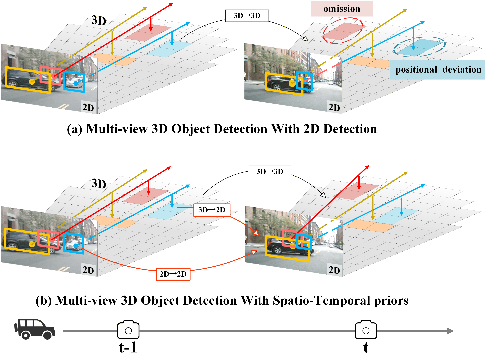
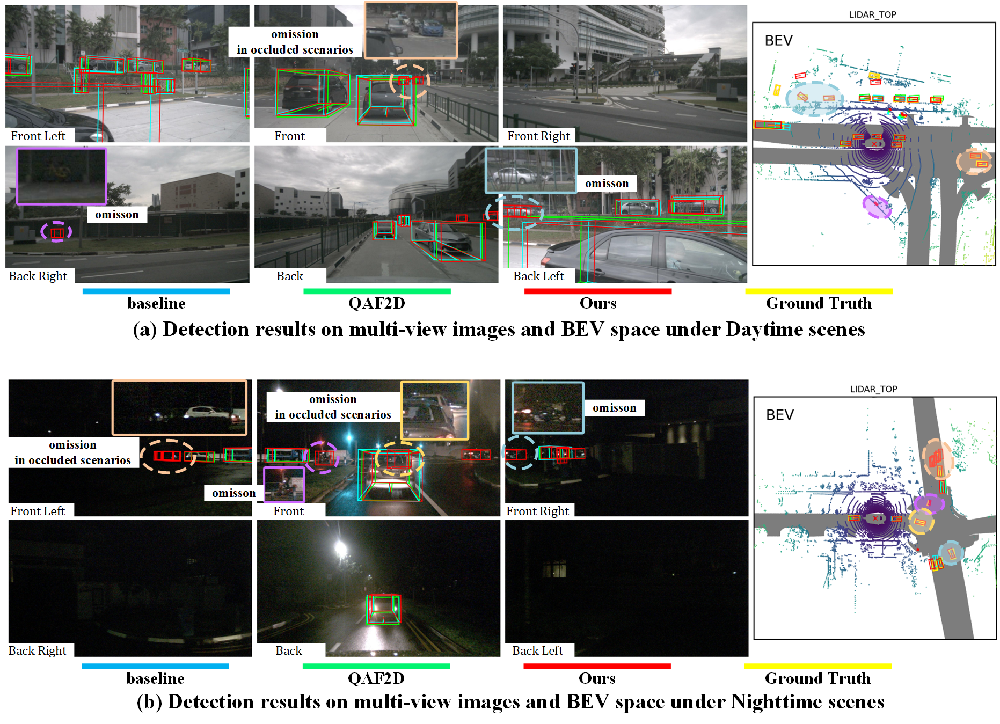

<div align="center">

# <font color="#2e6da4"> STUR3D: Spatio-Temporal Unified Representation Learning <br>for 3D Object Detection </font>

[Huijie Fan](mailto:fanhuijie@sia.cn) <sup>1†</sup>, 
[Pengrui Huang](mailto:huangpengrui@sia.cn) <sup>1,2†</sup>, 
[Qiang Wang](mailto:wangqiang@sia.cn) <sup>3*</sup>, 
Baojie Fan <sup>4</sup>, 
Jiahua Dong <sup>5</sup>, 
Liangqiong Qu <sup>6</sup>

<p align="center">
  <sup>1</sup> State Key Laboratory of Robotics and Intelligent Systems, 
  Shenyang Institute of Automation, Chinese Academy of Sciences <br>
  <sup>2</sup> Shenyang University of Chemical Technology <br>
  <sup>3</sup> Key Laboratory of Manufacturing Industrial Integrated Automation, Shenyang University <br>
  <sup>4</sup> Nanjing University of Posts and Telecommunications <br>
  <sup>5</sup> Mohamed bin Zayed University of Artificial Intelligence &nbsp;&nbsp;
  <sup>6</sup> The University of Hong Kong
</p>
<p align="center">
  <small><sup>†</sup> Equal contribution. &nbsp; <sup>*</sup> Corresponding author.</small><br>
</p>

[](https://your-paper-link.pdf)
[](https://github.com/snowindog/STUR3D)
[](#)

</div>
**Abstract:** Existing surrounding-view 3D object detectors typically initialize queries using 2D information from the current frame, leading to spatial and temporal inconsistencies. We propose **STUR3D**, a unified framework featuring three key components: **STOPP**, **STGE**, and **OQG**. STOPP addresses occlusion by introducing spatio-temporal object-centric point prompting; STGE unifies spatio-temporal geometric representations to resolve inconsistencies; and OQG utilizes depth-informed initialization for high-quality 3D queries. STUR3D achieves state-of-the-art performance, notably **64.6% NDS** and **57.9% mAP** on the nuScenes test benchmark.
<p align="center">
  <br>
</p>

---
## 🚩 News
- **[2026.03]** 🚀 **STUR3D** has been accepted by **CVPR 2026**!
- **[Coming Soon]** 🛠️ Training code and pre-trained models are being cleaned up and will be released soon.

---

## Motivation
<table align="center">
  <tr>
    <td align="center"><br><b>(a) a noticed</b></td>
    <td align="center"><br><b>(b) Overall Concept</b></td>
  </tr>
</table>

---

## Performance Performance

### nuScenes Val Set
<table align="center">
<thead>
<tr style="border-bottom: 2px solid black;">
<th align="left">Method</th>
<th align="center">Backbone</th>
<th align="center">Pretrain</th>
<th align="center">Res.</th>
<th align="center">mAP↑</th>
<th align="center">NDS↑</th>
</tr>
</thead>
<tbody>
<tr bgcolor="https://www.google.com/search?q=%23f2f2f2"><td align="left"><strong>STUR3D</strong></td><td align="center">R50</td><td align="center">ImageNet</td><td align="center">704×256</td><td align="center"><strong>44.8</strong></td><td align="center"><strong>55.0</strong></td></tr>
<tr bgcolor="https://www.google.com/search?q=%23f2f2f2"><td align="left"><strong>STUR3</strong></td><td align="center">R50</td><td align="center"><a href="https://github.com/open-mmlab/mmdetection3d">nuImage</a></td><td align="center">704×256</td><td align="center"><strong>48.6</strong></td><td align="center"><strong>57.9</strong></td></tr>
<tr bgcolor="https://www.google.com/search?q=%23f2f2f2"><td align="left"><strong>STUR3D</strong></td><td align="center">V2-99</td><td align="center"><a href="https://www.google.com/search?q=https://github.com/TRI-ML/dd3d">DD3D</a></td><td align="center">800×320</td><td align="center"><strong>53.0</strong></td><td align="center"><strong>61.2</strong></td></tr>
<tr bgcolor="https://www.google.com/search?q=%23f2f2f2"><td align="left"><strong>STUR3D)</strong></td><td align="center">R101</td><td align="center"><a href="https://github.com/open-mmlab/mmdetection3d">nuImage</a></td><td align="center">1408×512</td><td align="center"><strong>53.1</strong></td><td align="center"><strong>61.3</strong></td></tr>
</tbody>
</table>

### nuScenes Test Set
<table align="center">
<thead>
<tr style="border-bottom: 2px solid black;">
<th align="left">Method</th>
<th align="center">Backbone</th>
<th align="center">Pretrain</th>
<th align="center">Res.</th>
<th align="center">mAP↑</th>
<th align="center">NDS↑</th>
</tr>
</thead>
<tbody>
<tr bgcolor="https://www.google.com/search?q=%23f2f2f2"><td align="left"><strong>STUR3D</strong></td><td align="center">V2-99</td><td align="center"><a href="https://www.google.com/search?q=https://github.com/TRI-ML/dd3d">DD3D</a></td><td align="center">1600×640</td><td align="center"><strong>57.9</strong></td><td align="center"><strong>64.6</strong></td></tr>
</tbody>
</table>
<p align="center">
  <br>
  <i>Comparison with state-of-the-art methods on nuScenes dataset.</i>
</p>

---

## 📜 Citation
```bibtex
@inproceedings{huang2026stur3d,
  author={Fan, Huijie and Huang, Pengrui and Wang, Qiang and Fan, Baojie and Dong, Jiahua and Qu, Liangqiong},
  booktitle={2026 IEEE/CVF Conference on Computer Vision and Pattern Recognition (CVPR)},
  title={STUR3D: Spatio-Temporal Unified Representation Learning for 3D Object Detection},
  year={2026}
}
